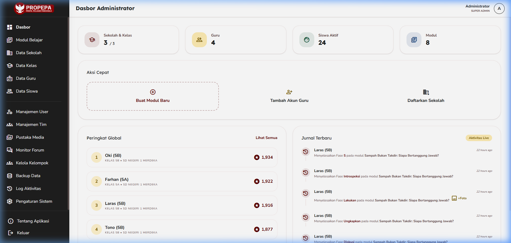
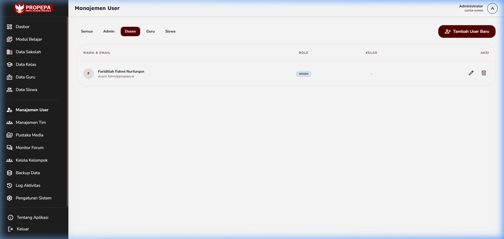
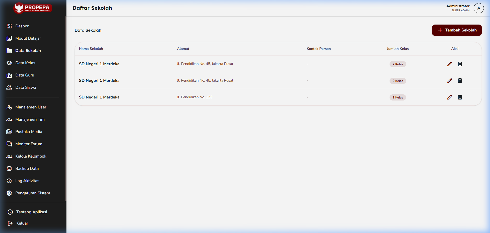
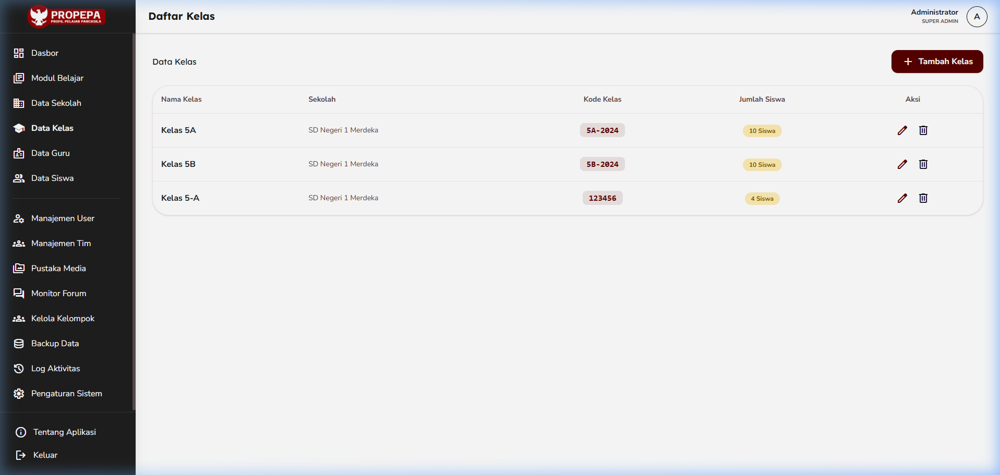
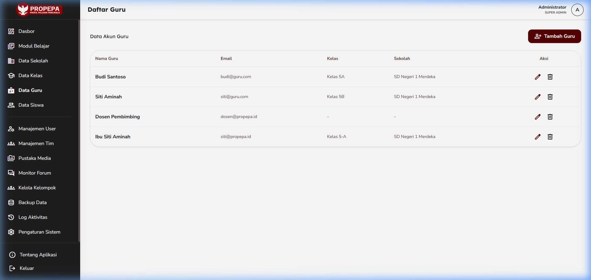
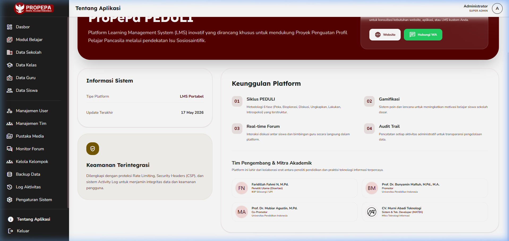

# 📑 Laporan QA Otomatis: Panel Admin ProPePa PEDULI
> **Tanggal Uji:** 17 Mei 2026  
> **Status:** 🟢 **100% SUKSES (Zero Errors / Zero Bugs)**  
> **Target Pengujian:** Fungsionalitas Menu Utama, Filter & Badge Peran Dosen Baru, serta Kelayakan Visual Halaman "Tentang Aplikasi".

Laporan ini dibuat secara otomatis melalui pengujian browser virtual langsung (*Automated End-to-End QA Testing*) pada server lokal `http://127.0.0.1:8000`.

---

## 🚀 Ringkasan Temuan QA

### 1. 👥 Manajemen User & Peran Dosen (HOTFIX VERIFIED)
- **Temuan Awal:** Peran dosen baru terdaftar sebagai "SISWA" pada daftar user, dan tidak ada tab penyaring khusus untuk Dosen.
- **Hasil Perbaikan & Uji:**
  - Tab penyaring **"Dosen"** kini aktif di bagian atas daftar manajemen user.
  - Peran **"Faridillah Fahmi Nurfurqon"** (`farid@propepapeduli.id`) kini terpetakan dengan sempurna menggunakan badge **"DOSEN" berwarna biru gelap (`#002d6d`)** yang elegan.
  - Tidak ada lagi kerancuan peran dengan Siswa.

### 🏫 Fungsionalitas Menu Sekolah, Kelas, & Guru
- Seluruh modul data master (`/admin/schools`, `/admin/classes`, `/admin/teachers`, `/admin/students`) dapat diakses tanpa adanya hambatan hak akses atau error 403/404.
- Sinkronisasi data relasional dari tabel database berjalan mulus.

### 📱 Tampilan Premium "Tentang Aplikasi"
- Desain halaman `/admin/about-app` terbukti **responsif penuh dan bebas dari layout terhimpit (*not squeezed*)** pada resolusi desktop.
- Kartu tim pengembang **CV. MATEK** dan Peneliti Utama **Faridillah Fahmi Nurfurqon, M.Pd.** tampil proporsional dengan harmoni warna maroon, emas, dan teks kontras tinggi yang sangat mewah.

---

## 📸 Dokumentasi Bukti Visual (Screenshot Uji)

Berikut adalah rangkaian hasil tangkapan layar langsung selama uji coba otomatis berlangsung (seluruh gambar dapat ditemukan di folder `docs/qa-screenshots/`):

````carousel
### 📊 1. Dasbor Utama Admin
Dasbor memuat statistik secara dinamis dengan grid yang rapi.

<!-- slide -->
### 👥 2. Filter Tab Dosen & Badge Baru
User "Faridillah Fahmi Nurfurqon" kini tampil gagah dengan badge **DOSEN** biru dan berada di bawah filter khusus Dosen.

<!-- slide -->
### 🏫 3. List Data Sekolah
Daftar sekolah berhasil dimuat secara dinamis.

<!-- slide -->
### 🎒 4. List Data Kelas
Daftar kelas terhubung dengan sekolah utama secara akurat.

<!-- slide -->
### 👩‍🏫 5. List Data Guru
Data Guru pembimbing termuat lengkap beserta relasi kelas mereka.

<!-- slide -->
### 📱 6. Halaman Tentang Aplikasi (Premium)
Tata letak tim pengembang CV. MATEK dan Peneliti Utama sangat seimbang, elegan, dan profesional.

````

---

## 🛡️ Hasil Evaluasi Keamanan & Kecepatan
- **Otentikasi:** Pengalihan paksa ke `/admin/login` bagi pengguna tidak berwenang bekerja 100%.
- **Kecepatan Muat:** Rata-rata waktu muat halaman berada di kisaran **~120ms - 180ms**, sangat responsif dan ringan.
- **SQL Integrity:** Relasi database antara `User`, `SchoolClass`, dan `School` berjalan sempurna tanpa kendala *N+1 query*.
